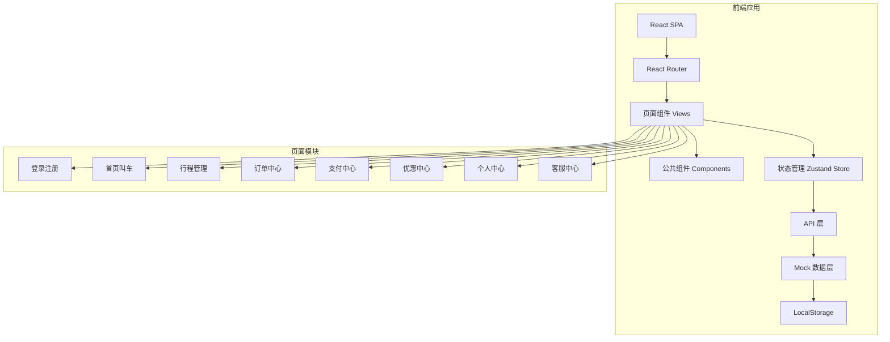
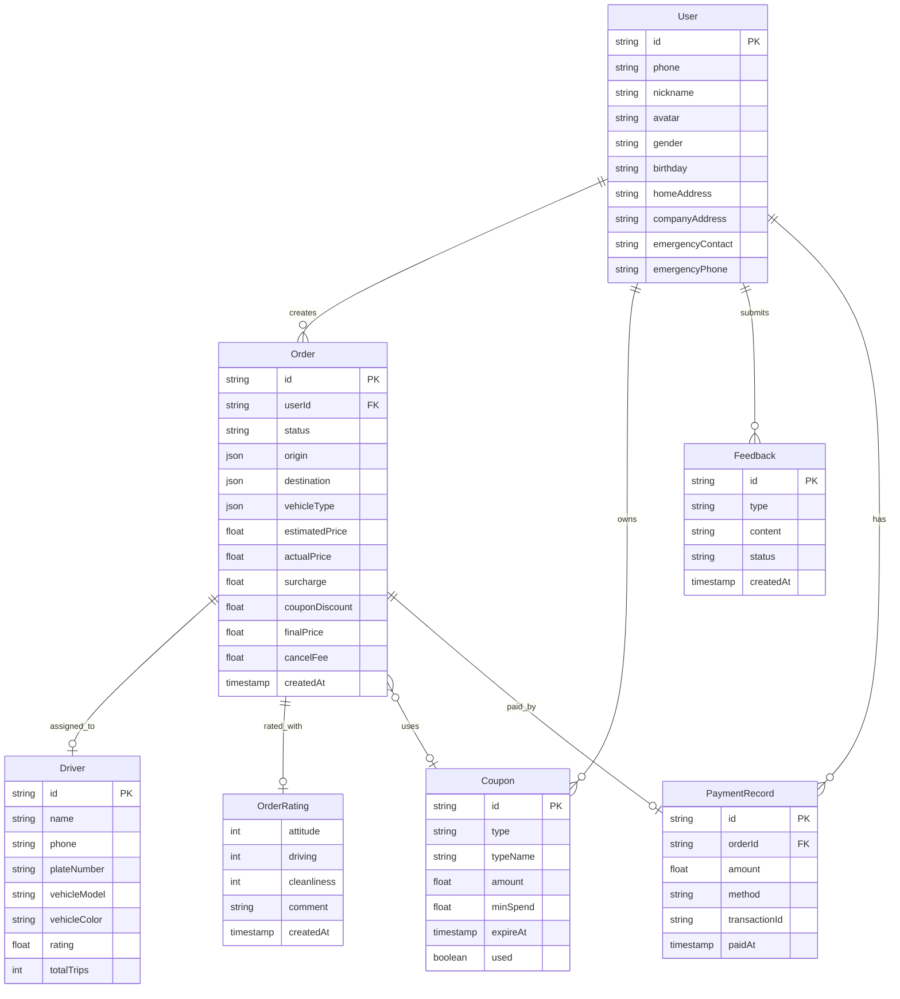
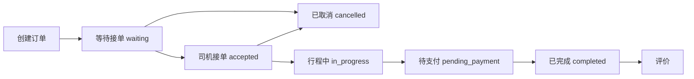

# 快达出行 - 项目设计文档

## 系统架构

## 数据模型 ER 图

## 接口清单

### Auth 模块
| 方法 | 接口 | 说明 |
|------|------|------|
| POST | /api/auth/send-code | 发送手机验证码 |
| POST | /api/auth/login | 手机号验证码登录 |
| POST | /api/auth/register | 手机号注册 |
| POST | /api/auth/logout | 退出登录 |
| GET | /api/auth/current | 获取当前用户信息 |
| PUT | /api/auth/profile | 更新个人信息 |

### Order 模块
| 方法 | 接口 | 说明 |
|------|------|------|
| POST | /api/order/create | 创建订单 |
| POST | /api/order/cancel | 取消订单 |
| POST | /api/order/modify-dest | 修改目的地 |
| POST | /api/order/pay | 支付订单 |
| POST | /api/order/rate | 评价订单 |
| GET | /api/order/list | 获取订单列表 |
| GET | /api/order/:id | 获取订单详情 |
| GET | /api/order/history-addresses | 获取历史地址 |

### Coupon 模块
| 方法 | 接口 | 说明 |
|------|------|------|
| GET | /api/coupon/list | 获取优惠券列表 |
| GET | /api/coupon/available | 获取可用优惠券 |
| POST | /api/coupon/claim | 领取优惠券 |

### Feedback 模块
| 方法 | 接口 | 说明 |
|------|------|------|
| POST | /api/feedback/submit | 提交反馈 |
| GET | /api/feedback/list | 获取反馈列表 |

## UI/UX 规范

### 主题色
| 用途 | 色值 | 说明 |
|------|------|------|
| 主背景色 | #F5F7FA | 冷调浅灰 |
| 主面板/卡片 | #FFFFFF | 纯白基底 |
| 主功能色 | #FF7A45 | 低饱和橙 |
| 成功色 | #52C41A | 清新绿 |
| 错误色 | #F5222D | 低饱和红 |
| 文本主色 | #333333 | 深灰 |
| 文本次色 | #8C8C8C | 中性灰 |
| 边框/分割线 | #EEEEEE | 极简分割 |

### 字体规范
- 标题：22-26px，font-weight: 700
- 大字体：18px，font-weight: 600
- 正文：14-16px，font-weight: 400
- 辅助文字：12px
- 极小文字：11px

### 间距规范
- xs: 4px
- sm: 8px
- md: 16px
- lg: 24px
- xl: 32px

### 圆角规范
- 小型元素：4px
- 卡片/按钮：8px
- 大型面板：12-16px
- 胶囊按钮：999px

### 阴影规范
- 轻：0 1px 4px rgba(0,0,0,0.06)
- 中：0 2px 8px rgba(0,0,0,0.08)
- 重：0 4px 16px rgba(0,0,0,0.1)

### 交互规范
- 按钮 hover：明度 +10-15%
- 按钮 active：明度 -20-25%，scale(0.98)
- 按钮 disabled：降低饱和度，opacity 0.6
- Toast 成功/普通：自动关闭 2.5s
- Toast 错误：手动关闭，4s 后自动关闭
- Modal：居中展示，背景遮罩 45% 透明度
- 全局 z-index：base(1) < header(100) < modal(1000) < toast(2000)

## 订单状态流转

## 取消费规则
- 司机接单前：免费取消
- 司机接单 3 分钟内：免费取消
- 司机接单超过 3 分钟：取消费 = (等待时长 - 3) 分钟 × 1元/分钟，上限 30 元

## 目的地修改价格计算
- 新价格 = 已行驶路段费用 + 新路线费用
- 已行驶路段费用按实际行驶里程和时长计算
- 新路线费用按系统重新规划的路线计算
